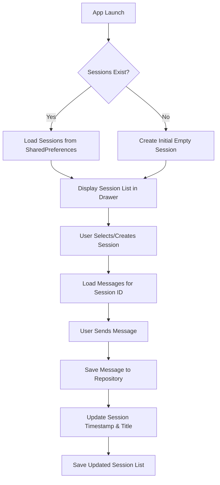

# Chat Session Persistence - Implementation Plan

## Overview
Implement full persistence for chat sessions so that all conversations and their message history are restored when the app is closed and reopened.

## Current State Analysis

### What Works ✓
- [`ChatRepository.java`](app/src/main/java/io/finett/droidclaw/repository/ChatRepository.java) already saves/loads chat messages using SharedPreferences with JSON
- Messages are automatically saved after each user/assistant message exchange
- Messages load correctly when switching between sessions

### What's Missing ✗
- Chat sessions themselves are not persisted
- [`MainActivity.loadMockChatSessions()`](app/src/main/java/io/finett/droidclaw/MainActivity.java:129) creates fresh mock data on every app launch
- Session list is lost when app closes, making saved messages inaccessible
- No auto-generated titles from first message
- No session deletion with message cleanup

## Architecture Design

### Data Flow Diagram



### Component Changes

#### 1. ChatRepository Enhancement
**Location**: [`app/src/main/java/io/finett/droidclaw/repository/ChatRepository.java`](app/src/main/java/io/finett/droidclaw/repository/ChatRepository.java)

**New Methods**:
- `saveSessions(List<ChatSession>)` - Serialize and save all sessions to SharedPreferences
- `loadSessions()` - Deserialize and return all saved sessions
- `deleteSession(String sessionId)` - Remove session and its messages (cascade delete)
- `updateSessionMetadata(String sessionId, String title, long timestamp)` - Update session info

**Data Structure**:
```json
{
  "sessions": [
    {
      "id": "uuid-string",
      "title": "Chat title from first message",
      "updatedAt": 1234567890
    }
  ]
}
```

#### 2. ChatSession Model Update
**Location**: [`app/src/main/java/io/finett/droidclaw/model/ChatSession.java`](app/src/main/java/io/finett/droidclaw/model/ChatSession.java)

**Changes**:
- Add setters for `title` and `updatedAt` (currently immutable)
- Add `setTitle(String)` method
- Add `setUpdatedAt(long)` method
- Keep constructor as-is for backwards compatibility

**Rationale**: Need to update session title from first message and timestamp when new messages arrive

#### 3. MainActivity Refactoring
**Location**: [`app/src/main/java/io/finett/droidclaw/MainActivity.java`](app/src/main/java/io/finett/droidclaw/MainActivity.java)

**Changes**:
- Add `ChatRepository` instance
- Replace `loadMockChatSessions()` with `loadPersistedSessions()`
- Save sessions after creating new chat
- Remove mock data generation logic
- Handle empty sessions list on first launch

**New Logic**:
```java
private void loadPersistedSessions() {
    List<ChatSession> savedSessions = chatRepository.loadSessions();
    if (savedSessions.isEmpty()) {
        // First launch - create initial session handled in onCreate
        return;
    }
    chatSessions.clear();
    chatSessions.addAll(savedSessions);
    chatSessionAdapter.submitList(new ArrayList<>(chatSessions));
}
```

#### 4. ChatFragment Enhancement
**Location**: [`app/src/main/java/io/finett/droidclaw/fragment/ChatFragment.java`](app/src/main/java/io/finett/droidclaw/fragment/ChatFragment.java)

**Changes**:
- After first message, generate session title from message content
- Update session metadata in repository
- Notify MainActivity to refresh session list display

**Title Generation Strategy**:
- Use first 30 characters of first user message
- Truncate at word boundary if possible
- Fallback to "New Chat" if message is empty/whitespace

## Implementation Tasks

### Task 1: Extend ChatRepository for Session Persistence
**Files**: [`ChatRepository.java`](app/src/main/java/io/finett/droidclaw/repository/ChatRepository.java)

Add session persistence methods using same SharedPreferences approach as messages:
- Use separate key `"chat_sessions"` for session list
- Serialize sessions to JSON array
- Handle JSON parsing errors gracefully
- Log all operations for debugging

### Task 2: Update ChatSession Model
**Files**: [`ChatSession.java`](app/src/main/java/io/finett/droidclaw/model/ChatSession.java)

Make fields mutable:
- Change `final` fields to regular private fields
- Add setter methods
- Maintain existing getters and constructor

### Task 3: Modify MainActivity Session Management
**Files**: [`MainActivity.java`](app/src/main/java/io/finett/droidclaw/MainActivity.java)

Replace mock data with real persistence:
- Initialize `ChatRepository` in `onCreate()`
- Load sessions from repository
- Save sessions after creating/modifying
- Remove `loadMockChatSessions()` method

### Task 4: Implement Session Save on Creation
**Files**: [`MainActivity.java`](app/src/main/java/io/finett/droidclaw/MainActivity.java)

When new chat is created:
- Add session to local list
- Save entire session list to repository
- Ensure session ID is passed to ChatFragment

### Task 5: Implement Session Update on Message Send
**Files**: [`ChatFragment.java`](app/src/main/java/io/finett/droidclaw/fragment/ChatFragment.java), [`MainActivity.java`](app/src/main/java/io/finett/droidclaw/MainActivity.java)

Update session metadata:
- Detect first message in session
- Generate title from first user message
- Update timestamp on every message
- Notify MainActivity to update session list

### Task 6: Add Session Deletion
**Files**: [`ChatRepository.java`](app/src/main/java/io/finett/droidclaw/repository/ChatRepository.java), [`MainActivity.java`](app/src/main/java/io/finett/droidclaw/MainActivity.java)

Implement cascade delete:
- Delete messages for session ID
- Remove session from session list
- Save updated session list
- Add UI trigger (long-press or swipe-to-delete)

### Task 7: Handle Edge Cases
**Files**: All modified files

Edge cases to handle:
- **Empty session list**: Create initial session automatically
- **First app launch**: No saved data exists
- **Corrupted JSON**: Clear and start fresh with logging
- **Orphaned messages**: Messages exist but session deleted
- **Session title updates**: Ensure UI refreshes

### Task 8: Test Complete Flow
**Testing Scenarios**:
1. Fresh install → create chat → send messages → close app → reopen → verify messages restored
2. Multiple sessions → switch between → close app → reopen → all sessions present
3. Create session → don't send message → close app → empty session should exist
4. Long session titles → verify truncation works
5. Delete session → verify messages also deleted

## Data Persistence Strategy

### SharedPreferences Structure
```
SharedPreferences: "chat_messages"
├── "session_<uuid1>": "[{message1}, {message2}, ...]"
├── "session_<uuid2>": "[{message1}, {message2}, ...]"
└── "chat_sessions": "[{session1}, {session2}, ...]"
```

### Benefits of Current Approach
- ✓ Simple SharedPreferences JSON storage
- ✓ No external dependencies
- ✓ Works offline
- ✓ Fast read/write operations

### Limitations to Consider
- SharedPreferences has ~1MB limit (acceptable for text chats)
- Not suitable for large media/attachments
- No encryption (consider for sensitive data)

### Future Enhancements (Out of Scope)
- Migrate to Room database for better scalability
- Add search functionality across sessions
- Export/import chat history
- Cloud sync capability
- Session pinning/favorites

## Success Criteria

The implementation is successful when:
1. ✓ All chat sessions persist across app restarts
2. ✓ Session list shows correct titles and timestamps
3. ✓ Messages load correctly for each session
4. ✓ New sessions are automatically saved
5. ✓ Session titles auto-generate from first message
6. ✓ No data loss on app close/crash
7. ✓ First app launch creates initial session
8. ✓ Session deletion removes associated messages

## Risk Mitigation

### Data Corruption
- Wrap all JSON operations in try-catch
- Log errors for debugging
- Clear corrupted data and start fresh if needed

### Performance
- Sessions list unlikely to be huge (< 100 sessions typical)
- JSON parsing is fast for small datasets
- Consider lazy loading if session count grows

### Testing
- Test on different Android versions
- Test with empty data (first launch)
- Test with corrupted SharedPreferences data
- Test rapid session creation/deletion

## Next Steps

After reviewing this plan, switch to **Code mode** to implement the changes step by step.